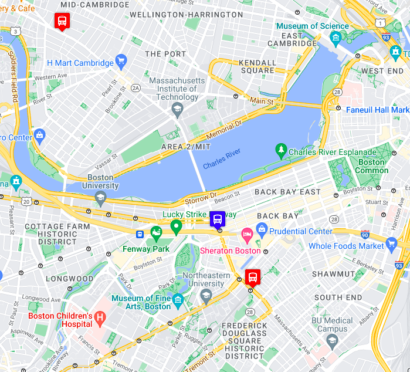

# BUS TRACKING EXERCISE
## Description
This code creates a map of Cambridge, Massachusettes and tracks busses going along their route using blue and red markers.

## How to Run
If you would like to run this code, you will need to:
* Fork the repository
* Clone the repository to your local workspace
* Generate your own google API and insert it into the code in the proper locations
* Drag and Drop the index.html file into a browser window to see the code in action

## Future Features
*Add styling to make the page more user friendly.
*Create interactivity for the map.

### License
[License](LICENSE)

